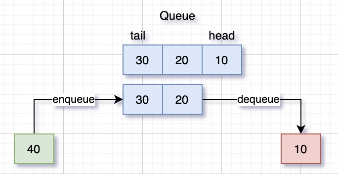
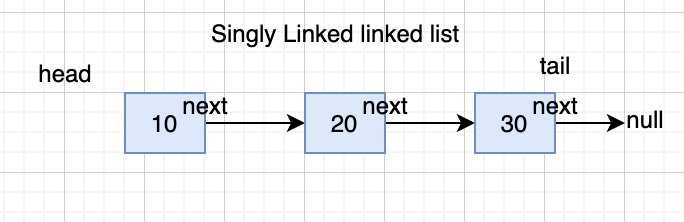
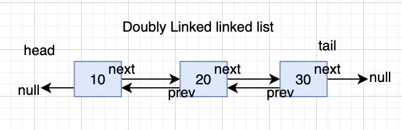

# Data Structures js
This repository contains some common useful data structure for javascript.

-----
## Big O Notation
Big O notation is a way to describe the space or time complexity of a given algorithm.

In following table Big O notations are arrange from best to worst case.
Notation (Time)     | Growth        | Description
-------------       | ------------- | -------------
`O(1)`              | Constant      |  Such operations takes constant time as number of items (n) grows
`O(log n)`          | Logarithmic   |  Such operations takes time initially but after some time they almost become constant time as number of items (n) grows
`O(n)`              | Linear        |  Such operations takes linear time as number of items (n) grows
`O(n^2)` or `O(n^c)`| Polynomial    |  Such operations takes more time as number of items (n) grows
`O(n^n)`            | Exponential   |  Such operations takes exponential time as number of items (n) grows
`O(n!)`             | factorial     |  Such operations are the worst of the worst

(n = size of input, c = some constant)

> Useful links 
- [MIT Lecture on Big O](https://web.mit.edu/16.070/www/lecture/big_o.pdf)
- [Basic understanding of Big O](https://www.digitalocean.com/community/tutorials/js-big-o-notation/)
- [Factorial Time Complexity](https://jarednielsen.com/big-o-factorial-time-complexity/)

-----
## Installation
```
npm install data-structures-js
```
-----
## Stack
Stack is a data structure which maintains list of element. It worked in LIFO (Last In First Out). 

Stacks are useful in scenarios where we need quick insertion and deletions with constant time complexity of `O(1)`.
we can always use `Array` to create the stack but for such stack will have a linear time `O(n)` complexity for insertion and deletions, as after inserting/removing a item we need to re-index all remaining items.

**Example** - If you a pile of books on your desk and if you need to add (or push) a book in the pile then you can add it on the top, similarly if you need to remove a book then you can remove (or pop) them only from the top. (unless you wanna make a mess)

> Useful links 
- [Javascript-stack](https://www.javascripttutorial.net/javascript-stack/)

### Basic Usage
```js
import Stack from 'data-structures-js/stack'

const stack = new Stack()

stack.push(10)
stack.push(20)

stack.pop() // output: 20
```
### Properties/Methods

Name            | Usage                                     | Time Complexity      | Description
-------------   | -------------                             | -------------        | -------------
first           | `stack.first`                             |  `O(1)`              | to get first item
last            | `stack.last`                              |  `O(1)`              | to get last item
size            | `stack.size`                              |  `O(1)`              | to get size of stack
list            | `stack.list`                              |  `O(n)`              | to get list of items as array
push            | `stack.push(value)`                       |  `O(1)`              | to add/push a item in stack
pop             | `stack.pop()`                             |  `O(1)`              | to remove/pop a item from the top
toArray         | `stack.toArray()`                         |  `O(n)`              | to get list of items as array
map             | `stack.map((value,index)=> value*10)`     |  `O(n)`              | to get list of items as array

-----
## Queue

A Queue is a linear structure which follows a FIFO (First In First Out) order in which the items will be processed.

Queue is useful when you don't have to be processed items immediately, but they have to process in order the are inserted as waiting line

**Example** - if you are in Coffee shop you need to wait for your turn until people before you in line finished their order.



> Useful links 
- [Javascript-Queue](https://www.javascripttutorial.net/javascript-queue/)

### Basic Usage
```js
import Queue from 'data-structures-js/queue'

const queue = new Queue()
// adding items
queue.enqueue(10)
queue.enqueue(20)
// removing items
queue.dequeue() // output: 20
```
### Properties/Methods

Name            | Usage                                     | Time Complexity      | Description
-------------   | -------------                             | -------------        | -------------
first           | `queue.first`                             |  `O(1)`              | to get first item
last            | `queue.last`                              |  `O(1)`              | to get last item
size            | `queue.size`                              |  `O(1)`              | to get size of queue
list            | `queue.list`                              |  `O(n)`              | to get list of items as array
enqueue         | `queue.enqueue(value)`                    |  `O(1)`              | to add a item in queue
dequeue         | `queue.dequeue()`                         |  `O(1)`              | to remove/pop a item from the top
toArray         | `queue.toArray()`                         |  `O(n)`              | to get list of items as array
map             | `queue.map((value,index)=> value*10)`     |  `O(n)`              | to get list of items as array
reset           | `queue.reset()`                           |  `O(1)`              | to reset queue to initial state all items will be removed

-----
## Singly Linked list
Single Linked List is a linear data structure like array but linked list items are not stored at a contiguous manner, in SLL items are linked with a pointer. so item always know the next item.


### Basic Usage
```js
import SinglyLinkedList from '../singly-linked-list'

const sll = new SinglyLinkedList()

sll.push(10)
sll.push(20)

sll.pop() // output: 20
```

### Properties/Methods

Name            | Usage                                   | Time Complexity      | Description
-------------   | -------------                           | -------------        | -------------
find            | `sll.find((value,index)=>value===10)`   |  `O(n)`              | to find a item with values and index
get             | `sll.get(index)`                        |  `O(n)`              | to get a item by index
head            | `sll.head`                              |  `O(1)`              | to get first item from SLL
pop             | `sll.pop()`                             |  `O(1)`              | to remove a item from the tail side
push            | `sll.push(value)`                       |  `O(1)`              | to add a item at tail side
map             | `sll.map((value,index)=> value*10)`     |  `O(n)`              | to get list of items as array
size            | `sll.size`                              |  `O(1)`              | to get number of items in SLL 
set             | `sll.set(index, value)`                 |  `O(n)`              | to add a node at index with provided value
shift           | `sll.shift()`                           |  `O(1)`              | to remove a item at head side
tail            | `sll.tail`                              |  `O(1)`              | to get last item from SLL
toArray         | `sll.toArray()`                         |  `O(n)`              | to get list of items as array
reset           | `sll.reset()`                           |  `O(1)`              | to reset queue to initial state all items will be removed
unshift         | `sll.push(value)`                       |  `O(1)`              | to add a item at head side


-----
## Doubly Linked List

-----
## Binary Search Tree

